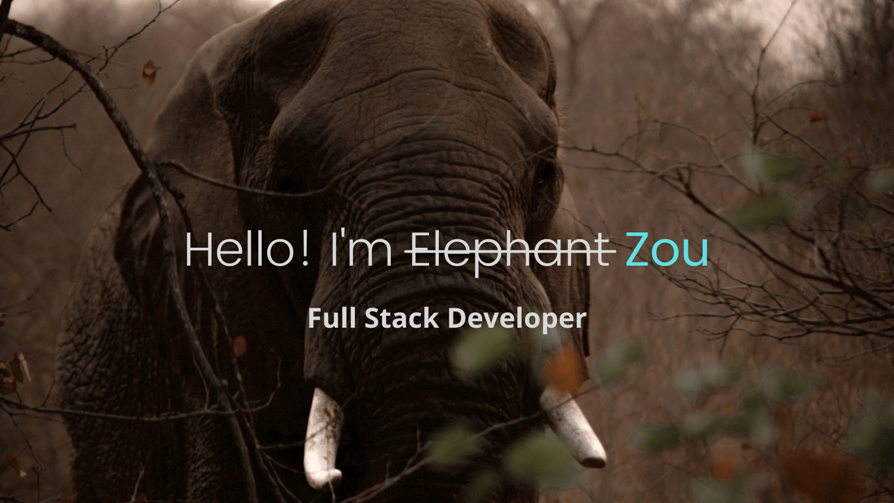

I am a self-motivated developer with a love of learning and clean code. 

I enjoy thinking about ways to improve application structure and code readability, and am constantly striving to learn new technologies as well as deepen my understanding of the basics.

## My favorite technologies
-  TypeScript
-  MongoDB
-  Express
-  React
-  Node

## Links
-  [LinkedIn](https://www.linkedin.com/in/zouminowa)
